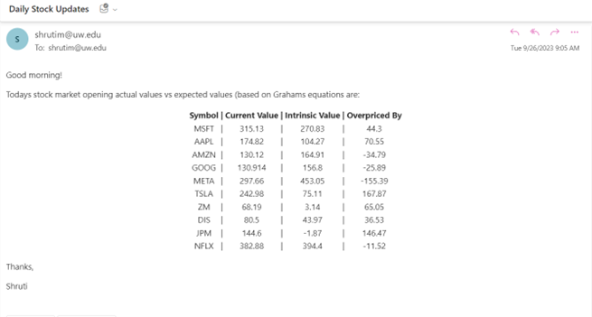

# Introduction
This project uses Graham's formula to calculate an intrinsic value for various company stocks based on the current yield, 
earnings per share for the company and its predicted growth rate over the next 5 years.
We compare this to the current value of the stock (at opening) to understand whether the stock is overpriced, underpriced 
or accurately priced. 
Our software is programmed to fetch relevant numbers, calculate the intrinsic value and send an email with the ticker 
symbols, current values, intrinsic values, and difference every day 5 minutes after opening. 

We get the necessary values from the Yahoo Finance website. Our project is made using an AWS EC2 instance linux server,
AWS SES, python and crontab. 

The daily emails look like this:

# Instructions
To run this project we need to make a couple installations. Run the following commands to have the project up and running!

1. Install Python 3.11.4

      Use this link or follow steps below
   
      > https://tecadmin.net/how-to-install-python-3-11-on-amazon-linux-2/
   
      Prerequisites   

         > sudo yum install gcc openssl-devel bzip2-devel libffi-devel zlib-devel -y 

      Download source code

         > wget https://www.python.org/ftp/python/3.11.4/Python-3.11.4.tgz

   Extract tarball file

         > tar xzf Python-3.11.4.tgz 

   Get into the extracted folder

         > cd Python-3.11.4 

   Configure the build process

         > sudo ./configure --enable-optimizations

   Compile and install

         > sudo make altinstall 

   Exit the Python3.11.4 directory

         > cd ..
   
   To clear space, remove the .tgz file

         > rm Python-3.11.4.tgz 
   
 
1. Clone this repository, create environment and activate:

   Clone the repository
         
         > git clone https://github.com/ShrutiMokate/Grahams-Emails.git

   Get into the cloned directory

         >  cd Grahamas-Emails

   Create a virtual environment called env

         >  python3.11 -m venv env 

   Activate the virtual environment

         >  source env/bin/activate  

   Side note: To exit environment use,

       > deactivate 

   
3. Install Python Packages:
Install packages from the requirements.txt file. 

         > pip install -r requirements.txt

4. Create email template: 
Create a template using the AWS CLI using this command

         > aws ses create-template --cli-input-json  file://dynamictabletemplate.json

5. Set up a cronjob:
Use the instructions in the link below and add a cronjob that resembles the crontab file you installed from this repository. 

   > https://jainsaket-1994.medium.com/installing-crontab-on-amazon-linux-2023-ec2-98cf2708b171
